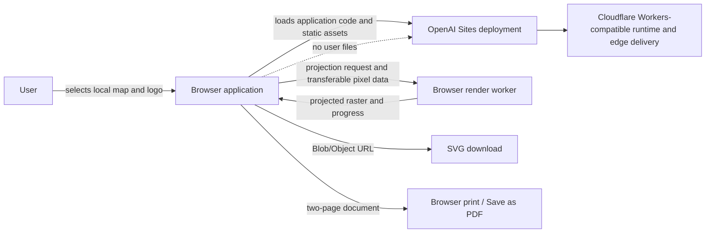

# Paper Globe

Paper Globe is a browser-based projection workshop that turns a 2:1 equirectangular world image into a printable paper-globe template. Image decoding, map reprojection, preview, layout, and export are intended to happen entirely on the user's device; source maps and logos are not uploaded.

> **Planning checkpoint:** the repository contains a functional prototype, but it is not yet production-ready. This document is the implementation contract for the next round of work. Code changes should begin only after the decisions in [Open decisions](#open-decisions) are resolved or explicitly deferred.

## Product definition

### Primary user and job

Paper Globe is for educators, designers, makers, and map enthusiasts who have an equirectangular world image and want to turn it into an accurately sized template they can print, cut, fold, and assemble without installing desktop GIS or illustration software.

The primary flow is:

1. Select a supported 2:1 source map.
2. Confirm that the image is valid and preview the source.
3. Choose the number of gores, finished globe diameter, paper size, and assembly marks.
4. Inspect both projected hemispheres and an assembled-globe coverage preview.
5. Export one hemisphere as SVG or print/download a complete two-sheet set.
6. Assemble the globe using clear cut, fold, and glue guidance.

### V1 goals

- Produce geometrically correct, print-to-scale north and south hemisphere templates.
- Keep source maps, optional logos, and generated files local to the browser.
- Make the complete workflow usable with keyboard, mouse, and touch.
- Support PNG, JPEG, and WebP equirectangular inputs and a deliberately chosen safe logo policy.
- Support 4, 6, 8, and 12 gores on US Letter, A4, and Tabloid paper.
- Export deterministic SVG and a dependable two-page print/PDF layout.
- Explain invalid input, unsupported configurations, rendering progress, and recovery steps clearly.
- Deploy through OpenAI Sites using the existing Cloudflare Workers-compatible Vinext build.

### V1 non-goals

- User accounts, cloud projects, or cross-device synchronization.
- Server-side file conversion, rendering, or storage.
- A public map library, stock imagery catalog, or map licensing marketplace.
- Collaboration, comments, sharing of editable projects, or organization workspaces.
- Native mobile or desktop applications.
- Professional prepress features such as CMYK conversion, ICC profiles, bleeds, or printer calibration beyond a scale-check marker.
- Arbitrary map projections or non-equirectangular source imagery.

## Current prototype

The deployable application is in `site/`. The current prototype already:

- validates PNG, JPEG, and WebP images for an approximately 2:1 aspect ratio;
- performs inverse spherical Cassini reprojection and bilinear raster sampling in the browser;
- renders 4, 6, 8, or 12 radial gores for either hemisphere;
- separates the raster map from SVG cut, fold, tab, label, and logo layers;
- exports the active hemisphere as SVG and opens a two-page browser print view;
- presents Letter, A4, and Tabloid controls and an optional logo layer; and
- provides source-map, template, and visual wrapped-globe views.

Important limitations of the current prototype:

- The diameter control is currently metadata only; it does not determine physical output dimensions.
- Template art uses a fixed 720-pixel render and fixed page offsets rather than a physical-unit layout engine.
- Reprojection is a synchronous, per-pixel operation on the main UI thread.
- Tests cover coordinate and Cassini round trips only; raster output, geometry, export, UI, and print behavior are untested.
- The globe view is a visual coverage aid, not a geometrically verified interactive 3D preview.
- File validation trusts browser-provided MIME information and does not yet enforce size, pixel-count, or SVG-safety limits.
- Export and print paths duplicate some composition behavior and can drift apart.
- Error, cancellation, cleanup, reduced-motion, small-screen, and cross-browser behavior need hardening.

## Architecture

### Architectural principles

1. **Local-first by design.** User-provided bytes never need to leave the browser for the V1 workflow.
2. **Pure math at the center.** Coordinate transforms and layout calculations remain deterministic, side-effect-free modules that can be tested without React or a DOM.
3. **One render specification.** Preview, SVG, and print output consume the same template geometry and settings so they cannot silently disagree.
4. **Physical units at export boundaries.** Page size, margins, globe diameter, line weights, and scale checks are modeled in millimeters or points, not incidental screen pixels.
5. **Responsive work off the main thread.** Expensive image sampling should not block input, navigation, or status updates.
6. **Progressive enhancement.** A current evergreen browser gets the best worker/OffscreenCanvas path; a tested fallback keeps the core workflow available where possible.
7. **No backend until a product requirement needs one.** Database, object storage, authentication, and upload endpoints stay absent from V1.

### System context



The hosting runtime serves the application shell and its static assets. All user-image decoding, projection, compositing, and export remain browser responsibilities. No V1 route should accept user imagery in an HTTP request.

### Runtime boundaries

| Boundary | Responsibility | Must not own |
| --- | --- | --- |
| Application shell (`site/app/`) | Workflow UI, accessible controls, validation feedback, status, preview selection, and orchestration | Projection formulas, print geometry, persistence, or uploaded-file networking |
| Domain modules (`site/src/globe/`) | Coordinates, projection, gore geometry, paper layout, render specifications, and export serialization | React state or framework APIs |
| Render worker (planned) | Raster sampling, cancellation, progress, and high-resolution projected outputs | UI state, downloads, printing, or network calls |
| Browser platform adapters | Image decode, Canvas/ImageBitmap, Blob/Object URLs, download, and print-window lifecycle | Business rules or projection math |
| Hosting runtime | Serve versioned application assets and framework responses | Map uploads, render jobs, saved projects, or user identity in V1 |

### Planned source organization

The exact filenames may evolve, but these ownership boundaries should remain clear:

```text
site/
├── app/
│   ├── layout.tsx                 # Metadata and root document
│   ├── page.tsx                   # Route composition only
│   └── components/                # Product-specific workflow components
├── components/ui/                 # Reusable shadcn primitives
├── src/globe/
│   ├── coordinates.ts             # Longitude/latitude and pixel conversions
│   ├── cassini.ts                 # Forward/inverse spherical Cassini math
│   ├── geometry.ts                # Gore outlines, seams, tabs, folds, labels
│   ├── paper.ts                   # Physical page sizes, margins, fit rules
│   ├── specification.ts           # Validated, serializable render specification
│   ├── raster.ts                  # Sampling and pixel-buffer operations
│   ├── render.worker.ts           # Background projection entry point
│   ├── preview.ts                 # Screen-resolution composition adapter
│   ├── svg.ts                     # SVG serialization
│   └── print.ts                   # Two-page print document adapter
└── tests/
    ├── projection.test.ts
    ├── geometry.test.ts
    ├── raster.test.ts
    ├── export.test.ts
    └── fixtures/                  # Small, generated, license-safe test images
```

`page.tsx` should be decomposed only where it clarifies a product boundary. Avoid introducing a generic service layer, global state library, or server API for a single-route, client-local application.

### Canonical render specification

All previews and exports should be derived from one immutable, validated specification rather than separate component state and ad hoc constants:

```ts
type GlobeSpecification = {
  source: {
    widthPx: number;
    heightPx: number;
    colorSpace: 'srgb';
  };
  projection: {
    kind: 'spherical-cassini';
    goreCount: 4 | 6 | 8 | 12;
  };
  output: {
    finishedDiameterMm: number;
    paper: 'letter' | 'a4' | 'tabloid';
    orientation: 'portrait';
    rasterDpi: number;
  };
  marks: {
    cutLines: boolean;
    foldLines: boolean;
    glueTabs: boolean;
  };
  logo?: {
    position: 'north-pole' | 'south-pole' | 'equator';
    scale: number;
  };
};
```

The source image and decoded pixel buffer do not belong in this serializable model. They are session resources referenced by an internal ID and released when replaced or when the page closes.

### Data flow and lifecycle

1. The browser receives a user-selected `File`; no upload or form submission occurs.
2. The input adapter checks file type, byte size, image dimensions, aspect ratio, decode success, and pixel-count limits before rendering.
3. The image is decoded once to an `ImageBitmap` or equivalent canvas source.
4. UI settings are normalized into a `GlobeSpecification`; invalid paper/diameter combinations are rejected before work begins.
5. A monotonically increasing render ID is sent to the worker with decoded image data and the specification.
6. The worker projects each required hemisphere, periodically reports progress, and stops stale work when a newer render ID arrives.
7. The UI displays the latest successful preview while new work is pending, then swaps results atomically.
8. SVG and print adapters use the same geometry and projected raster result at an output-appropriate resolution.
9. Object URLs, ImageBitmaps, canvases, and worker resources are released when superseded and on unmount.

### Projection and raster pipeline

- Treat longitude as wrapping at the antimeridian and latitude as clamped at the poles.
- Keep spherical Cassini forward and inverse functions pure and define their valid domains explicitly.
- Derive gore central meridians and half-width from the selected gore count.
- Generate a single canonical outline per hemisphere/gore count; rotate or transform it for each gore instead of recomputing equivalent geometry.
- Use inverse mapping from each destination pixel to the source image to avoid holes.
- Retain bilinear sampling for V1, including horizontal wrap and vertical clamp behavior.
- Define alpha behavior explicitly: preserve source transparency in downloadable SVG while compositing against the selected paper background for print.
- Use a lower-resolution preview target and a separate export target calculated from physical size and output DPI.
- Cap input and output pixel counts to prevent accidental memory exhaustion. Provide a clear message rather than allowing the tab to crash.
- Compare known graticule and checkerboard fixtures at the equator, poles, gore edges, and antimeridian.

### Physical layout and print model

Print accuracy is a release-blocking requirement. The implementation must replace the current fixed-pixel layout with a physical-unit model:

- Represent paper dimensions and safe margins in millimeters.
- Define the mathematical relationship between requested finished diameter and the template's pole-to-equator length.
- Compute available printable bounds after header, footer, marks, and printer-safe margins.
- Determine whether the requested diameter fits the selected paper and gore arrangement at 100% scale.
- Never silently shrink a template while preserving the requested diameter label. Offer a valid maximum, require a larger paper size, or explicitly label any reduced scale.
- Keep cut and fold strokes at useful printed weights independent of raster DPI.
- Ensure glue tabs do not overlap neighboring gores, page bounds, important map content, or the pole cap.
- Include a labeled physical scale-check line or square so users can detect printer scaling.
- Document that browser print settings must use 100%/actual size and disable fit-to-page.
- Verify north and south pages use identical scaling and alignment conventions.
- Decide whether large configurations need tiled/multi-page output before implementation; do not imply that every diameter fits every paper size.

### UI and state model

The application remains a single working surface. The first viewport should expose upload, essential template settings, a useful preview, and export status without a marketing interstitial.

Use a reducer or a small set of cohesive React hooks for these state categories:

- **Session resource state:** current source file, decoded image, optional logo, and disposal handles.
- **Specification state:** gore count, physical diameter, paper, marks, and branding placement.
- **Render state:** idle, validating, rendering with progress, ready, cancelled, or failed.
- **View state:** source/template/globe tab, active hemisphere, dialogs, and nonessential local preferences.
- **Export state:** preparing, ready, printing, downloaded, or failed.

Do not add a global state dependency unless state genuinely spans unrelated routes or features. Keep a last-known-good preview visible during rerenders, debounce slider-driven work, make reset restore documented defaults, and prevent export while results are stale.

### Export architecture

- Build a renderer-neutral scene description containing the page, raster placement, paths, labels, marks, logo, and scale check.
- Serialize that scene to standalone SVG for downloads.
- Produce both hemisphere pages from the same scene builder for print/PDF.
- Embed raster data intentionally and escape all text/attribute content.
- Wait for print assets and fonts to be ready, focus the print window, and clean up generated URLs after printing or cancellation.
- Give files deterministic, descriptive names that include hemisphere, gore count, diameter, and paper size.
- Preserve vector cut/fold/tab layers even when the projected map is embedded as a raster.
- Define whether the complete-set download remains print-only or gains a ZIP/two-page PDF export in V1; see [Open decisions](#open-decisions).

## Hosting and delivery

### Selected services

| Concern | Selected service | Rationale and boundary |
| --- | --- | --- |
| Site lifecycle and deployment | OpenAI Sites | The repository already has a Sites project in `site/.openai/hosting.json`. Sites manages site versions, access policy, deployment, and hosted runtime values. |
| Application runtime | Cloudflare Workers-compatible output | Vinext and the Cloudflare Vite plugin build the React application to Worker-compatible ESM. The runtime serves the app; it does not process user images. |
| Static asset delivery | Sites/Cloudflare deployment | Versioned JavaScript, CSS, icons, and the social card are deployed with the application bundle. |
| Database | None for V1 | `d1` is intentionally `null`; there is no server-side product state. |
| Object storage | None for V1 | `r2` is intentionally `null`; user files and generated templates are not uploaded. |
| Authentication | None for V1 product behavior | Deployment access may be owner-only, shared, or public, but the app itself has no accounts. |
| Analytics and error reporting | Not selected | Any future service must be privacy-reviewed and must not capture image bytes, generated SVG content, filenames, or other user content. |

### Build and deployment topology

- Node.js 22.13 or newer is the supported build environment.
- npm and the committed `package-lock.json` are the dependency contract.
- Vinext supplies the Next-compatible React application model.
- Vite, the OpenAI Sites plugin, and the Cloudflare plugin create the deployable bundle.
- Wrangler is a local development adapter for the generated Worker configuration, not a separate production hosting target.
- `.openai/hosting.json` is the source of truth for the Sites project and logical D1/R2 bindings. It must not contain secrets or general environment configuration.
- Local secrets, if ever introduced, belong in ignored `.env*` files with non-secret names documented in `.env.example`; hosted runtime values are managed through Sites.
- A production release consists of a successful validation build, an immutable Sites version tied to the validated source, and a deployment of that exact version.

### Environment strategy

V1 needs no application environment variables. Development and production should therefore behave identically for product logic.

If future scope adds server capabilities, establish distinct development and production resources, declare only supported logical bindings in the hosting manifest, and add a threat/privacy review before enabling them. Do not add D1 or R2 preemptively.

### Access, domain, and release policy

- Keep preview deployments owner-only while the print model and security gates are incomplete.
- Before the first broader release, explicitly choose owner-only, shared, or public Sites access; deployment must not change audience implicitly.
- Confirm whether the existing `chatgpt.site` address is the canonical production URL or whether a custom domain is required.
- Update `metadataBase`, canonical metadata, Open Graph metadata, and any robots/sitemap policy to match the chosen production URL and audience.
- Preserve the existing social preview unless branding changes; verify its content and metadata before release.
- Use versioned deployments so rollback means redeploying the last known-good version, not editing production in place.

### CI and release gates

The repository does not currently define hosted CI. Before public release, choose either a repository CI workflow or a documented, repeatable local release checklist. At minimum, every release must run:

```bash
cd site
npm ci
npm run format
npm run lint
npm run test:projection
npm run build
```

As test coverage is added, replace the projection-only script with a complete `npm test` entry and keep focused test commands available for development. Formatting should fail on differences in CI rather than silently changing release source.

Release evidence should record the source revision, test/build result, selected access policy, deployed Sites version, smoke-test result, and rollback target. Generated build output, credentials, and deployment archives must remain uncommitted.

## Privacy, security, and content safety

### Privacy contract

- No uploaded map or logo is sent over the network.
- No filename, image dimension, export content, or project setting is included in analytics or error reports.
- No source or generated template is written to IndexedDB, local storage, Cache Storage, D1, or R2 in V1.
- Browser memory and temporary object URLs are released as soon as practical, with page close as the final cleanup boundary.
- The UI and privacy documentation must describe actual behavior and be backed by a network-level test.

### Input hardening

- Verify decoded content in addition to extension and declared MIME type.
- Set documented maximum file bytes, dimensions, and total pixels based on measured browser memory use.
- Reject malformed, animated, or unsupported images with actionable feedback.
- Normalize orientation and color-space behavior so preview and export agree.
- Decide the logo policy before release. The safest V1 option is raster-only PNG/JPEG/WebP. If SVG remains supported, sanitize and rasterize it before preview/export rather than embedding untrusted markup directly.
- Never render user-controlled strings through raw HTML. Escape all SVG/XML text and attribute data.
- Add a restrictive Content Security Policy compatible with local `blob:` image/worker use, along with standard security headers supported by the host.

### Abuse and resource limits

Because processing is client-side, the main abuse risk is device resource exhaustion rather than server cost. Bound source pixels, output DPI, concurrent jobs, and retained canvases. Cancel stale jobs and surface memory-friendly alternatives for oversized inputs. No server endpoint should be added merely to work around weak client limits without revisiting the privacy contract.

### Licensing and user responsibility

The product must not imply that every map or logo may be reproduced. Keep a concise reminder that users are responsible for rights to uploaded material. Repository fixtures and documentation images must be original, public domain, or stored with clear compatible licensing and attribution.

## Accessibility, responsiveness, and browser support

- Target WCAG 2.2 AA for the workflow, including contrast, focus visibility, names, error association, and keyboard operation.
- Make drag-and-drop optional; the file picker must provide the complete flow.
- Announce validation, render progress, completion, cancellation, and export errors through appropriate live regions without excessive repetition.
- Keep the uploaded map's filename from becoming the sole status indicator.
- Ensure canvas previews have concise text alternatives describing hemisphere, gore count, and settings; do not attempt to narrate arbitrary map pixels.
- Honor reduced-motion and forced-colors preferences.
- At narrow widths, stack controls and preview without trapping focus or forcing horizontal page scrolling.
- Ensure touch targets are appropriately sized and the primary actions remain reachable.
- Define a supported browser matrix before release. Initial target: current and previous major versions of Chrome/Edge, Firefox, and Safari, with iOS Safari explicitly tested for memory and print limitations.
- Where direct printing is unreliable on mobile, provide an honest download-first path rather than a broken Print action.

## Quality strategy

### Unit tests

- Coordinate conversion at image edges, poles, equator, and antimeridian.
- Longitude normalization and angular distance around wrap boundaries.
- Cassini forward/inverse round trips across every supported gore width.
- Gore central meridians, outline symmetry, path closure, and seam continuity.
- Diameter-to-physical-layout calculations for every paper/gore combination.
- Fit rejection and maximum-diameter suggestions.
- SVG/XML escaping, deterministic filenames, logo visibility, and mark toggles.

### Raster and visual fixtures

- Use small generated graticule, quadrant-color, checkerboard, transparent, and seam-marker inputs.
- Assert representative destination pixels and use tolerant image snapshots for projected hemispheres.
- Verify no transparent holes occur inside expected gore bounds.
- Verify adjacent gore edges sample the same source meridian within tolerance.
- Keep fixtures small and license-safe; do not commit arbitrary user maps.

### Component and workflow tests

- Successful upload, invalid type, invalid ratio, decode failure, and oversized input.
- Settings changes, debounced rerender, cancellation, stale-result rejection, and reset.
- North/south switching and agreement between preview and exported settings.
- Logo acceptance/rejection and placement rules.
- Export disabled states, object-URL cleanup, print-popup failure, and recovery.
- Keyboard flow, focus restoration for dialogs, and live-region announcements.

### End-to-end and print verification

- Run the primary workflow in each supported browser family.
- Confirm through network inspection that uploaded bytes never leave the page.
- Parse exported SVG and verify physical page dimensions, embedded assets, paths, and safe markup.
- Print reference templates at 100%, measure the scale marker and critical dimensions, and record tolerances.
- Assemble at least one globe for each gore count before V1; inspect seam fit, pole convergence, tab usability, orientation, and antimeridian continuity.
- Test representative valid/invalid diameter and paper combinations.
- Smoke-test the exact deployed URL after release, including asset loading and one small projection/export.

### Performance budgets

Final budgets should be based on measurements from representative desktop and mobile devices. Initial release targets are:

- Keep controls responsive while projection is active; no long main-thread task caused by raster sampling.
- Show visible progress or a determinate phase within 200 ms of starting a nontrivial render.
- Cancel a stale render promptly when settings or source change.
- Avoid decoding the same source repeatedly.
- Retain no more than the active source, latest preview, and currently required export buffers.
- Complete a preview render for a representative 4096×2048 map in a few seconds on a midrange laptop; establish exact percentile targets after profiling.

## Observability and operations

V1 should favor privacy-preserving operational signals over user-level tracking:

- Build and deployment failures are observable through the Sites release process.
- Client errors are handled locally with actionable messages and stable error categories.
- If aggregate telemetry is later justified, collect only allow-listed event names, coarse duration buckets, browser capability flags, and anonymous counts after consent and privacy review.
- Never log filenames, dimensions tied to identity, image data, data URLs, SVG payloads, or free-form error content derived from user files.
- Maintain a release checklist and a short incident/rollback procedure in the repository before public launch.

## Implementation roadmap

Phases are ordered by dependency, not by calendar date. Each phase should finish with its tests and documentation; avoid postponing validation to a final cleanup pass.

### Phase 0 — Resolve the product and geometry contract

**Work**

- Resolve the blocking items in [Open decisions](#open-decisions), especially geometry style, diameter meaning, fit behavior, and logo input policy.
- Write examples for one valid and one invalid paper/diameter combination.
- Define print tolerances, default DPI, file/pixel limits, supported browsers, and V1 export set.
- Turn decisions into short architecture decision records in this README or a future `docs/decisions/` directory.

**Exit criteria**

- A reviewer can calculate the expected physical size of a template from a sample specification.
- The UI behavior for configurations that do not fit is unambiguous.
- Privacy claims and supported input/output formats are settled.

### Phase 1 — Establish domain types and print-correct geometry

**Work**

- Introduce the canonical `GlobeSpecification` and runtime validation.
- Separate projection math, gore geometry, and paper layout.
- Replace fixed page constants with physical-unit calculations.
- Implement fit validation, maximum-size guidance, scale check, and shared scene description.
- Preserve current UI behavior while moving it onto the new model.

**Exit criteria**

- Unit tests cover every supported paper/gore combination.
- Diameter changes produce measured, proportional output.
- Preview and export use the same geometry specification.

### Phase 2 — Make raster rendering responsive and deterministic

**Work**

- Extract DOM-independent sampling from canvas adapters.
- Add a render worker with job IDs, progress, cancellation, and stale-result protection.
- Decode once, transfer data efficiently, and cache only reusable results with bounded memory.
- Add preview and export resolution policies plus graceful fallback behavior.
- Add generated raster fixtures and seam/pole/alpha tests.

**Exit criteria**

- UI controls remain responsive during a representative render.
- Repeated settings changes cannot display or export a stale result.
- Fixture output is deterministic within documented tolerances.

### Phase 3 — Unify SVG, print, and optional complete-set export

**Work**

- Build SVG and print pages from the shared scene.
- Enforce physical dimensions, vector mark weights, deterministic naming, and XML safety.
- Implement the selected logo policy and logo rasterization if required.
- Harden print-window loading, popup failure, cleanup, and actual-size instructions.
- Implement a complete-set file only if chosen for V1.

**Exit criteria**

- Exported north and south sheets agree with preview and each other.
- SVG parses cleanly and contains no unsanitized user markup.
- Physical output passes the documented measurement tolerance.

### Phase 4 — Harden the end-to-end user experience

**Work**

- Decompose the page into product components and focused hooks/reducer without changing the single-surface architecture.
- Add complete validation, progress, error, recovery, reset, and stale-export states.
- Make the workflow responsive and fully operable with keyboard and touch.
- Replace or clearly label the globe placeholder according to the Phase 0 decision.
- Add accessible status announcements and canvas alternatives.

**Exit criteria**

- Primary workflow tests pass for valid and invalid inputs.
- No essential action requires drag-and-drop, hover, precision pointing, or a large screen.
- Export cannot run against missing or outdated render data.

### Phase 5 — Security, privacy, and compatibility hardening

**Work**

- Enforce file, dimension, pixel, and job-memory limits.
- Add MIME/content verification and finalized SVG handling.
- Apply a tested Content Security Policy and host-supported security headers.
- Run network privacy checks and cross-browser/mobile tests.
- Verify URL cleanup and absence of unintended persistence.

**Exit criteria**

- Automated or documented tests demonstrate that user content is not transmitted.
- Oversized and malformed files fail safely.
- The supported-browser matrix and known limitations are published.

### Phase 6 — Release automation and production launch

**Work**

- Add/choose CI and make the full format, lint, test, and build sequence repeatable.
- Verify production metadata, social preview, canonical URL, access policy, and privacy copy.
- Build the exact release source, save an immutable Sites version, and deploy that version.
- Smoke-test the deployed URL and record the rollback target.
- Keep the initial deployment owner-only until approval is given for the selected broader access level.

**Exit criteria**

- All release gates pass from a clean checkout using the lockfile.
- The deployed version matches the validated source.
- Rollback and incident steps are documented and tested at least once.

### Phase 7 — Post-launch validation and only then expansion

**Work**

- Collect privacy-safe issue patterns and performance measurements.
- Prioritize correctness, browser compatibility, and assembly problems before features.
- Revisit optional capabilities such as interactive 3D preview, saved local presets, multi-page tiling, or additional export formats only with evidence of need.
- Re-evaluate hosting/storage architecture if a future feature genuinely requires server state.

**Exit criteria**

- V1 acceptance metrics and known issues are reviewed.
- Any V2 proposal includes its privacy, hosting, and operational impact.

## Open decisions

Items marked **blocking** must be resolved before their dependent phase begins.

| Decision | Current recommendation | Status / blocks |
| --- | --- | --- |
| Template geometry | Keep the current two radial hemisphere sheets only if physical prototypes confirm seam and pole behavior; otherwise switch to a documented conventional gore layout before hardening exports. | **Blocking Phase 1** |
| Diameter definition | Define diameter as the assembled globe's outside paper surface diameter; derive template arc length mathematically and document tolerance. | **Blocking Phase 1** |
| Oversized configurations | Prevent export at a false scale; show maximum diameter for selected paper and offer a compatible paper size. Consider tiling only after V1. | **Blocking Phase 1** |
| Printable margins | Use conservative configurable safe margins based on paper rather than assuming borderless printing. Final values require physical print tests. | **Blocking Phase 1** |
| Export DPI | Use a lower preview resolution and default final raster target appropriate for home printing; select the final DPI after memory/performance measurements. | **Blocking Phase 2** |
| Logo formats | Prefer raster-only logos for V1. Retain SVG only if the implementation sanitizes and rasterizes it before use. | **Blocking Phase 3** |
| Complete-set download | Keep single-hemisphere SVG plus two-page Print/Save as PDF, or add a ZIP/two-page PDF. Decide based on the expected classroom/maker workflow. | **Blocking Phase 3** |
| Globe view | Label it as a coverage preview, or implement a real WebGL/Canvas sphere with accessible fallback. Avoid implying geometric validation from the current CSS mock. | **Blocking Phase 4** |
| Browser limits | Establish maximum input bytes/pixels and maximum export pixels from tests on Safari/iOS and a midrange desktop. | **Blocking Phase 5** |
| Deployment audience | Owner-only during development; explicitly approve shared or public access for launch. | **Blocking Phase 6** |
| Production domain | Decide whether the existing `chatgpt.site` URL is canonical or a custom domain is required. | **Blocking Phase 6** |
| Analytics | Default to none. Add only privacy-preserving aggregate telemetry if post-launch operations demonstrate a need. | Deferred |

## Definition of done for V1

V1 is complete only when all of the following are true:

- A supported map can be loaded, projected, previewed, and exported without sending user content over the network.
- Every supported gore count has passed math tests, raster fixtures, print measurement, and physical assembly review.
- Requested diameter controls the physical output, invalid fits cannot be mislabeled, and a printed scale check is present.
- Preview, SVG, and two-page print output are derived from the same render specification and geometry.
- Main-thread responsiveness, cancellation, cleanup, and memory limits meet the agreed budgets.
- Input validation and logo handling meet the documented security policy.
- The workflow passes accessibility, responsive, and supported-browser checks.
- The complete automated test/build gate passes from a clean checkout.
- Production metadata, access policy, privacy copy, smoke test, and rollback target are verified for the deployed Sites version.
- Known limitations are documented honestly and no placeholder is presented as a finished feature.

## Development

The application requires Node.js 22.13 or newer and uses npm.

```bash
cd site
npm ci
npm run dev
```

Current checks:

```bash
npm run format
npm run lint
npm run test:projection
npm run build
```

`npm run start` runs the generated Worker build locally after `npm run build`. Do not add cloud resources, secrets, or deployment steps merely to run the browser-local workflow.

## License

MIT. See [LICENSE](LICENSE).
